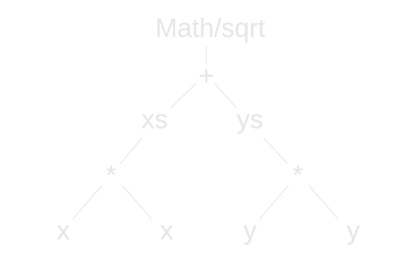

class: center, middle, inverse
layout: true

---

# Creative Coding With Clojure

Slides: [tinyurl.com/bristech-clojure](http://tinyurl.com/bristech-clojure)

---
layout: false
# Matt Thompson

- EngD student at Bath/Sysemia ltd
- Researching procedural narratives in games
- Love tinkering with odd languages

---

class: center, middle, inverse

# What is it, and why should I care?

---

# Clojure

- It's a dialect of Lisp
- It runs on the JVM (Java Virtual Machine)
- Can use Java libraries
- Encourages *immutable* data structures
- This makes it ideal for concurrency
- Very simple syntax

---

class: inverse
# Clojure example

    (defn my-function [x y]
        (let [xs (* x x) ys (* y y)]
            (Math/sqrt (+ xs ys))))

---

class: inverse
# Clojure example

    (defn my-function [x y]
        (let [xs (* x x) ys (* y y)]
            (Math/sqrt (+ xs ys))))

    var my-function = function(x, y) {
        var xs = x * x;
        var ys = y * y;
        return sqrt(xs + ys);
    }

---
class: center, middle, inverse

# It's a tree!

---

class: center, middle, inverse

# OK, so what's Lisp?

---

# Lisp

- One of the oldest programming languages
- Designed in 1958 (!) by John McCarthy
- Multi-paradigm (esp. functional programming)
- Encourages meta-programming
- Most popular dialects: Common Lisp, Scheme
- ...and now Clojure!

---
class: inverse
## Lots of Irritating, Silly Parentheses
    ;; unreadable
    (defn dot-product [xs ys] (loop [acc 0.0, xr
    xs, yr ys] (if (or (empty? xr) (empty? yr)) acc
    (recur (+ acc (* (first xr) (first yr))) (rest
    xr) (rest yr)))))

---
class: inverse
## Lots of Irritating, Silly Parentheses
    ;; much better
    (defn dot-product [xs ys]
        (loop [acc 0.0, xr xs, yr ys]
           (if (or (empty? xr) (empty? yr))
              acc
              (recur (+ acc (* (first xr) (first yr)))
                     (rest xr)
                     (rest yr)))))

---

class: center, middle, inverse

# Relevant XKCD

---

class: center, middle, inverse

# Syntax time!

---
class: center, middle, inverse

# What macros do

---

# Light Table

- A new editor written in Clojurescript
- Inspired by a talk called "[Inventing on Principle](vimeo.com/36579366)" by Bret Victor
- Built for "live coding"
- In very early alpha
- Also supports JS, Python (right now), but is designed for Clojure(script)

---

class: center, middle, inverse

# What is "live coding"?

A quick demo

---

# Overtone

- build synthesisers!
- compose music algorithmically!
- live-coding performances!

---

# Quil

- tool for coding generative art
- similar to Processing, but in Clojure
- Processing is often used for interactive installations, etc

---

# So, why use Clojure(script)?

- Expand your knowledge
- Functional is the future
- Great community
- Great tools
- Rich Hickey

---
class: inverse

# Learning resources

- Clojure for the Brave and True: [braveclojure.com](http://braveclojure.com)
- Light Table Clojure(script) tutorial: [github.com/swannodette/lt-cljs-tutorial](http://github.com/swannodette/lt-cljs-tutorial)

---
class: center, middle, inverse

# Bristol Clojurians

Web: [bristolclojurians.org](http://bristolclojurians.org)
Twitter: [@BristolClojure](http://twitter.com/BristolClojure)
Meetup: [meetup.com/Bristol-Clojurians/](http://www.meetup.com/Bristol-Clojurians/)
Google Group: [groups.google.com/forum/#!forum/bristolclojurians](https://groups.google.com/forum/#!forum/bristolclojurians)

---
class: center, middle, inverse

# Questions

Slides online at [cblop.github.io/bristech-clojure](http://cblop.github.io/bristech-clojure)
